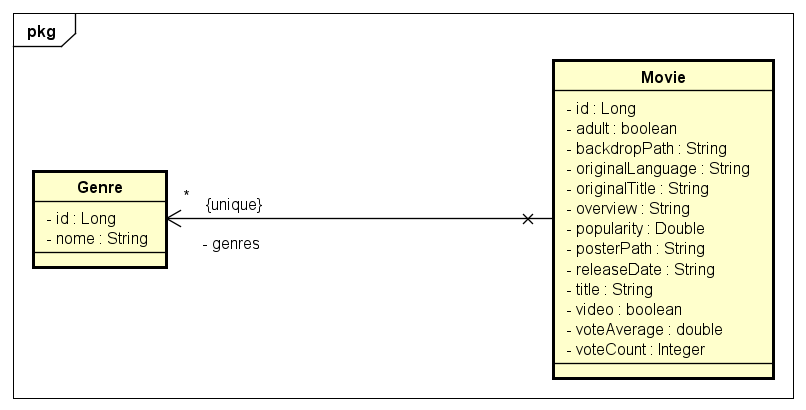
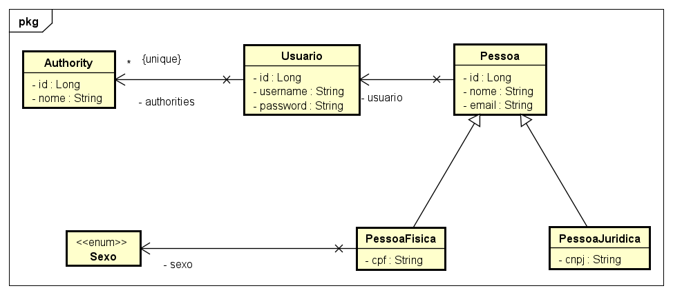
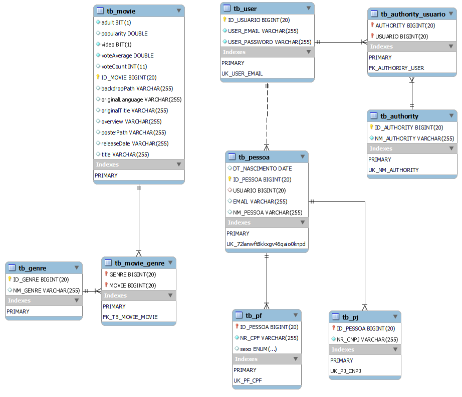

# Benezinho - Movies 🍿 🤓👍🏾


|                | **ENTERPRISE APPLICATION DEVELOPMENT** |
|------------------------------------------|----------------------------------------|
| **ALUNO:**                               | **TURMA:**                             |
| **PROFESSOR:** Benefrancis do Nascimento |                                        |
| **Checkpoint**                           | 08/11/2023                             |

# Sumário


[Estudo de caso ](#_Estudo_de_caso)

[O que deverá ser feito? ](#_O_que_devera_ser_feito)

[Diagrama de Classes ](#_Diagrama_de_Classes)

[Diagrama de Entidades e Relacionamentos ](#_DER)

[Correção ](#_Correcao)

<a id="_Estudo_de_caso"></a>

# Estudo de caso


A Holding Benezinho  não para de crescer, para o próximo ano a equipe de tecnologia pretende disponibilizar para o grande público uma plataforma de filmes e séries. O objetivo é fornecer serviços com mais qualidade que os atuais.

A empresa passará a disponibilizar Aplicativo em território nacional.

Contratamos você como Engenheiro de Software para nos ajudar a construir esse sistema.

Na sprint atual, você foi incumbido de fazer:

1. O Mapeamento Objeto Relacional das entidades;

2. A correta persistências de todas as entidades.

4. A criação de dos métodos capazes de realizar operações respeitando as interfaces genéricas Repository, Service e Resource:


<a id="_O_que_devera_ser_feito"></a>

# O que deverá ser feito?


**Faça o Fork do projeto no github do professor :**

https://github.com/Benefrancis/benezinho-movie.git

Caso o github esteja indisponível, você deverá pegar o projeto no diretório compartilhado.

**Você deverá:**

Alterar o arquivo contido em documentacao/equipe.txt para incluir o RM do aluno que fará esta atividade.


1. **(10 Pontos)** Implementar corretamente todas as classes conforme solicitado abaixo:


   1. **(4,3 Pontos) Domínio Genre**
       1. (0,5 Ponto) **Implementar corretamente a classe GenreRepository**
          1. (0,125 Ponto) Implementar corretamente o padrão Sigleton
          2. (0,125 Ponto) Implementar corretamente o método findAll
          3. (0,125 Ponto) Implementar corretamente o método findById
          4. (0,125 Ponto) Implementar corretamente o método persist
       2. (0,475 Ponto)  **Implementar corretamente a classe GenreService**
          1. (0,25 Ponto) Implementar corretamente o padrão Sigleton
          2. (0,075 Ponto) Implementar corretamente o método findAll
          3. (0,075 Ponto) Implementar corretamente o método findById
          4. (0,075 Ponto) Implementar corretamente o método persist
       3. (0,225 Pontos) **Implementar corretamente a classe GenreResource**
          2. (0,075 Ponto) Implementar corretamente o método findAll
          3. (0,075 Ponto) Implementar corretamente o método findById
          4. (0,075 Ponto) Implementar corretamente o método persist
       4. (1,5 Ponto) **Implementar corretamente a record GenreDTO**
          1. (0,5) Implementar Corretamente o método **public static GeneroDTO of(Genero g)**
          2. (1,0) Implementar Corretamente o método **public static Genero of(GeneroDTo dto)**
      5. (1,6 Ponto) **Implementar corretamente a Classe Genre**
         1. Realizar o correto mapeamento Objeto Relacional da classe Genre


   2. **(5,7 Pontos) Domínio Movie**
      1. (0,5 Ponto) **Implementar corretamente a classe MovieRepository**
         1. (0,125 Ponto) Implementar corretamente o padrão Sigleton
         2. (0,125 Ponto) Implementar corretamente o método findAll
         3. (0,125 Ponto) Implementar corretamente o método findById
         4. (0,125 Ponto) Implementar corretamente o método persist
      2. (0,475 Ponto)  **Implementar corretamente a classe MovieService**
         1. (0,25 Ponto) Implementar corretamente o padrão Sigleton
         2. (0,075 Ponto) Implementar corretamente o método findAll
         3. (0,075 Ponto) Implementar corretamente o método findById
         4. (0,075 Ponto) Implementar corretamente o método persist
      3. (0,225 Pontos) **Implementar corretamente a classe MovieResource**
         2. (0,075 Ponto) Implementar corretamente o método findAll
         3. (0,075 Ponto) Implementar corretamente o método findById
         4. (0,075 Ponto) Implementar corretamente o método persist
      4. (1,5 Ponto) **Implementar corretamente a record MovieDTO**
         1. (0,5) Implementar Corretamente o método **public static MovieDTO of(Movie m)**
         2. (1,0) Implementar Corretamente o método **public static Movie of(MovieDTo dto)**
      5. (3 Pontos) **Implementar corretamente a Classe Movie**
         1. Realizar o correto mapeamento Objeto Relacional da classe Movie 


Deverá implementar:


<a id="_Diagrama_de_Classes"></a>

# Diagrama de Classes de Domínio





<a id="_DER"></a>

# Diagrama de Entidades e Relacionamentos




<a id="_Correcao"></a>

# Correção da Prova

A correção da prova será disponibilizada no github do professor (branch correcao):

Para acessar digite no prompt:

```shell
git clone https://github.com/Benefrancis/benezinho-movie.git && cd javapet && git checkout correcao
```

A atividade é individual, em caso de fraude de qualquer tipo todos os envolvidos receberão nota ZERO.

Boa prova.
